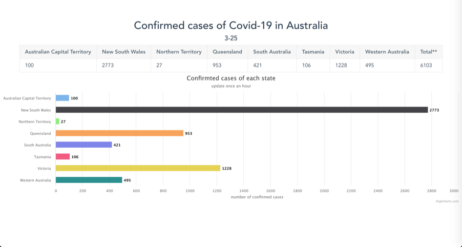
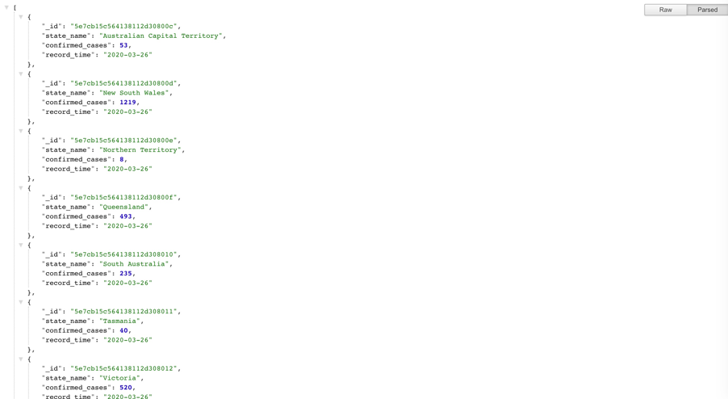
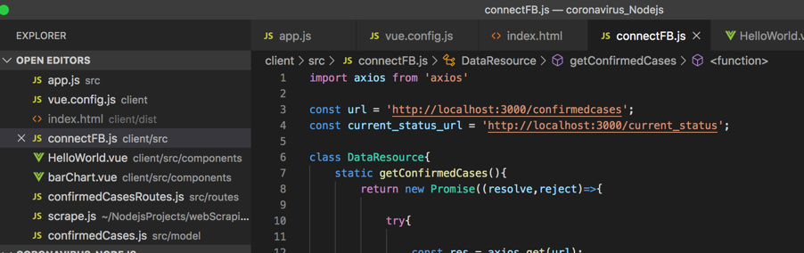
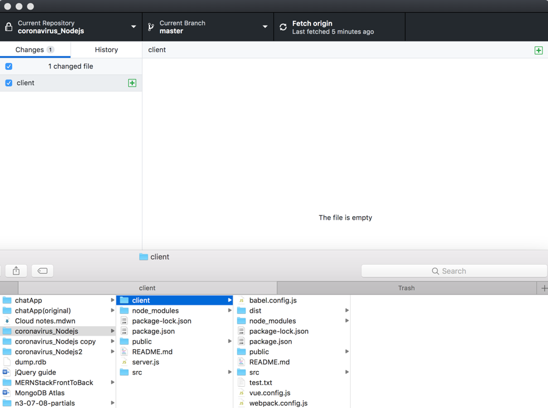
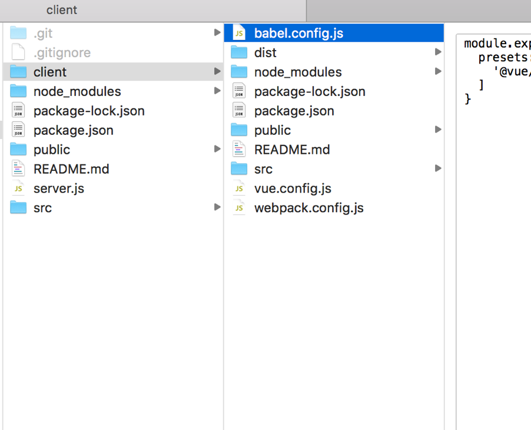
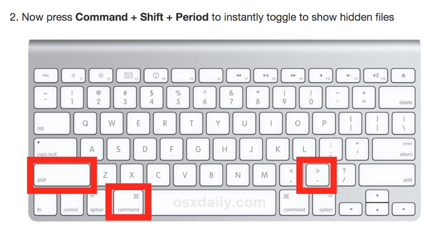

# coronavirus_Nodejs
 
This is a fullstack project.**(deprecated)**  
1. I crawl date of Coronavirus (COVID-19) current situation and case numbers from the website of Australian Government Department of Health
2. Then save the data on MongoDB atlas.
3. connect to a MongoDB database from a Node.js script

The screenshot of project:  

http://localhost:3000/confirmedcases  
(get data from mogodb atlas)  

How to run the project：

Npm run dev  
Cd client  
npm run serve  

  
explain:  

Npm run dev： start backend  

npm run serve: start frontend  

 

problem review:
1. In development, I use localhost to get data locally.However, you must replace it with the real domain name when deploying. Otherwise, although it runs well on your own computer, it will not run when deployed to the server, and some servers cannot install node. I bought the wrodpress server before. Node is not supported. Therefore, it cannot be deployed and needs to be changed to another server.

2. Unable to upload folder to github,the reason is multiple .git conflicts, and the original client folder also has a .git folder.  

3. Show Hidden Files on MacOS with a Keyboard Shortcut  

